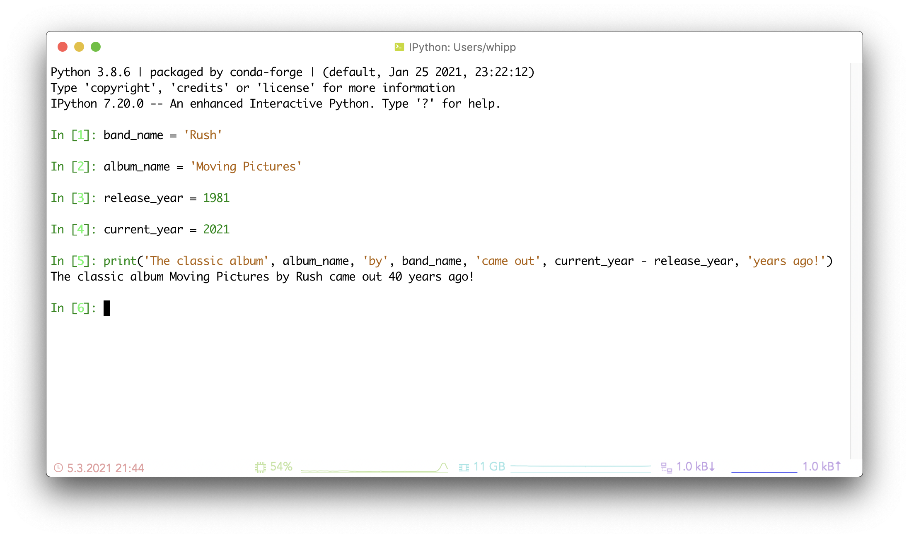
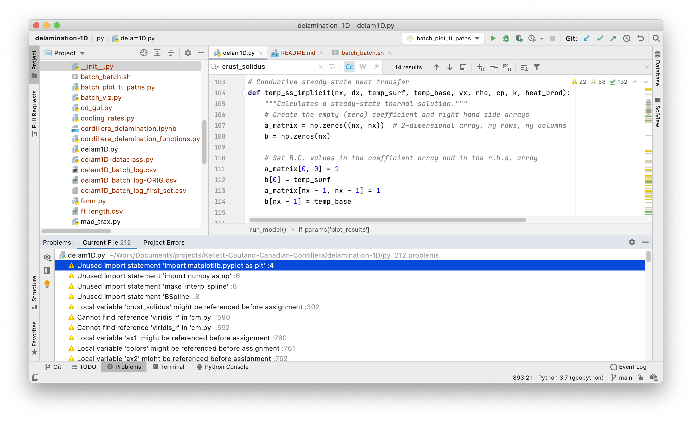

---
jupyter:
  jupytext:
    text_representation:
      extension: .md
      format_name: markdown
      format_version: '1.2'
      jupytext_version: 1.6.0
  kernelspec:
    display_name: Python 3
    language: python
    name: python3
---

# Other coding environments

## The Python interpreter

One of the simplest options for coding in Python is to use the Python interpreter (Figure 1.10). The Python interpreter is an interface where Python code can be typed and executed when you press Enter. In this way it is similar to a "Code" cell in a Jupyter notebook. For very simple tasks and for testing short sections of Python programs, the Python interpreter can be the fastest and easiest option. The history of commands may be recorded when using the Python interpreter, however commands that have been entered in the interpreter are not saved to a file and you should thus use the Python interpreter as a "temporary" coding environment.

_**Figure 1.10**. The IPython console, an enhanced Python interpreter._

## Integrated development environments (IDEs)

At the other end of the spectrum in terms of comprehensiveness and complexity are integrated development environments (IDEs; Figure 1.11). IDEs are software applications that typically include a source code editor, debugging tools, a file browser, software version control tools, and a linter that can be used to detect syntax errors in source code. The idea of an IDE is to assemble relevant software development tools into a single application that can help users develop better software more quickly and with fewer errors. For new programmers, an IDE can be somewhat intimidating, but can also be helpful because many IDEs will indicate syntax errors and suggest fixes in the source code. These include some errors that may be difficult to identify from runtime errors that arise when the code is executed.

_**Figure 1.11**. The PyCharm IDE._

There are several excellent IDEs for Python software development, including JupyterLab, PyCharm, Visual Studio Code, Spyder, and IDLE. We briefly describe some of the key attributes of each below.

- **JupyterLab** is a web-based IDE for working with Jupyter notebooks. It builds upon the earlier Jupyter notebook application by making the layout of the file browser, interactive notebook panel, Python interpreter, and system terminal flexible and viewable within the same window, like most IDEs. There is also a system for adding functionality to JupyterLab with useful plugins for version control and other IDE features. We recommend using JupyterLab with the Jupyter notebooks included with this textbook.
- **PyCharm** is an advanced IDE designed specifically for use in Python programming (Figure 1.11). It is perhaps the most comprehensive option of all in the list here, offering excellent integrated tools for developing well-formatted, clean Python code. PyCharm also supports Jupyter notebooks and a free educational edition that includes all the tools available in the Professional edition.
- **Visual Studio Code** is another IDE, but not one designed specifically for Python. Instead, Visual Studio Code (or VSCode) is a generic source code editor that can be expanded to function like an IDE through extensions, including those specific to Python and Jupyter notebooks. VSCode is highly customizable, and may appeal to those wanting to use the same IDE for programming in Python and other programming languages.
- **Spyder**, the Scientific Python Development Environment, is yet another IDE designed specifically for programming in Python. This free and open-source IDE excels in scientific applications and offers a number of excellent tools that are useful in debugging programs. Specifically, Spyder's variable explorer is a great way to check the values assigned to variables and arrays and ensure your programs are functioning correctly.
- **IDLE**, Python’s Integrated Development and Learning Environment, is a lightweight IDE that is included with many Python distributions. It is not as feature rich as some of the other options listed above, but computers that have Python installed may also already have IDLE available. This can be handy when you're working on a machine where you're not able to install other software.
