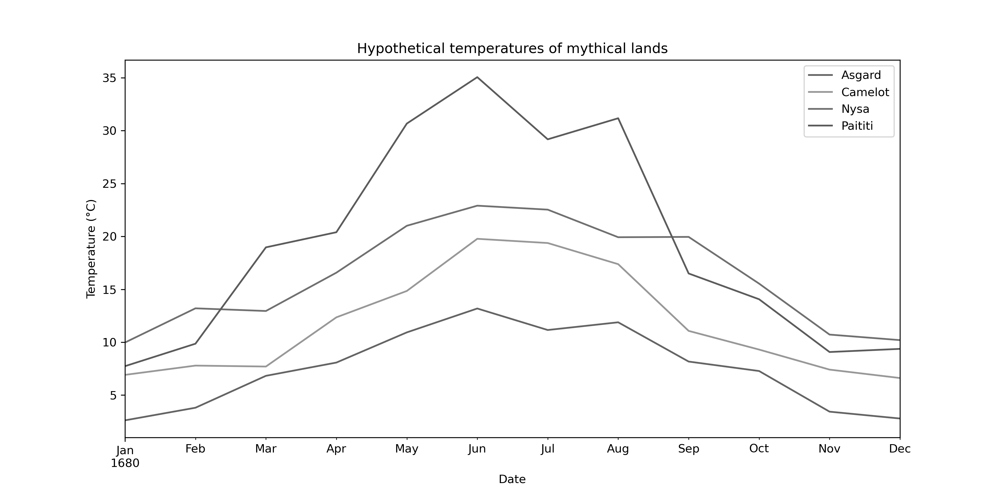

---
jupyter:
  jupytext:
    text_representation:
      extension: .md
      format_name: markdown
      format_version: '1.3'
      jupytext_version: 1.11.5
  kernelspec:
    display_name: Python 3 (ipykernel)
    language: python
    name: python3
---

# Effective plot design: line plots

As we have seen, you should be aiming to produce plots that include all of the elements that help make understanding the plotted data intuitive. Typically, this might include:

- Axis labels, including units if needed
- A legend
- Grid lines
- Plot and/or figure titles
- Annotation on the plot, such as text

In addition, there are several factors that can help improve the communication of the plotted information. When plotting line data, for example, the color of the lines might be an important consideration to tell different lines apart. This is especially true when plotting several lines on the same axes, as readers will need to be able to differentiate the lines and know which line refers to a given set of data. But there is more to plotting lines than simply choosing nice colors. 

Not all people viewing your plots will see them the same way. Some viewers may have color blindness, while others may have printed out a copy of your plot in grayscale from a printer. Thus, while choosing nice colors can help make your plots look visually pleasing to you, it is worthwhile to consider other viewers and formats in which your plots may be viewed. In this way your visualizations can be as inclusive to different viewers as possible.

## Tips for plotting lines

Let's consider an illustrative example. In this case we have four lines and we will use some random values just to provide a sense of the the issue. We can start by importing the Matplotlib and NumPy libraries. NumPy is a numerical Python library that we will use to generate arrays of random numbers.

```python
# Load the libraries we need
import numpy as np
import matplotlib.pyplot as plt
```

Now that we have imported the libraries we need, we can generate a set of x-axis values that range from zero to one, with 11 values in the array. We can use the `np.linspace()` function for this, which generates values starting from one number and ending at another. We can then generate four arrays of y-axis values that are random and offset by 0.25 between the lines to make it easier to see all four lines. We will use the `np.random.rand()` function to generate the random numbers.

```python
# Define the number of values for each line
num_points = 11

# Create arrays of x- and y-axis values
x = np.linspace(0.0, 1.0, num_points)
y1 = np.random.rand(num_points)
y2 = np.random.rand(num_points) + 0.25
y3 = np.random.rand(num_points) + 0.5
y4 = np.random.rand(num_points) + 0.75
```

Now we have a set of x-axis values in the variable `x` and four sets of y-axis values in the variables `y1` to `y4`. We can now create a figure and plot the four lines.

```python
# Create figure
fig, ax = plt.subplots(1, 1, figsize=(10, 5))

# Plot lines
ax.plot(x, y1, label="line 1")
ax.plot(x, y2, label="line 2")
ax.plot(x, y3, label="line 3")
ax.plot(x, y4, label="line 4")

# Turn on legend and set x-axis limits
ax.legend()
ax.set_xlim([x.min(), x.max()])
```

So, we can see that four different colors have been used here for the different lines. This is visually OK for some situations, but what happens if the figure were to be printed in grayscale?



_**Figure 4.X**. Grayscale line plot._

Here we can see that it is no longer easy to tell which line is which in the plot, so color alone is not helping in plotting these lines.

A better option would be to change the line pattern for each line so they can be distinguished easily irrespective of the selected line colors. That can be done using the `linestyle` parameter in Matplotlib, as shown below.

```python
# Create figure
fig, ax = plt.subplots(1, 1, figsize=(10, 5))

# Plot lines
ax.plot(x, y1, linestyle="solid", label="line 1")
ax.plot(x, y2, linestyle="dotted", label="line 2")
ax.plot(x, y3, linestyle="dashed", label="line 3")
ax.plot(x, y4, linestyle="dashdot", label="line 4")

# Turn on legend and set x-axis limits
ax.set_xlim([x.min(), x.max()])
ax.legend()
```

Here, the line styles `solid`, `dotted`, `dashed`, and `dashdot` have been used to define the pattern of each line. Other options for line patterns can be found in the [Matplotlib documentation online](https://matplotlib.org/stable/gallery/lines_bars_and_markers/linestyles.html) [^linestyles]. In this case viewers can easily tell which line is which whether they have colorblindness or have printed a figure from a printer. This simple tip for line plots can make a big difference in ensuring all viewers see the same data.

We will return to the topic of selecting colors and other visualization tips in greater detail in Chapter 8.


## Footnotes

[^linestyles]: <https://matplotlib.org/stable/gallery/lines_bars_and_markers/linestyles.html>
